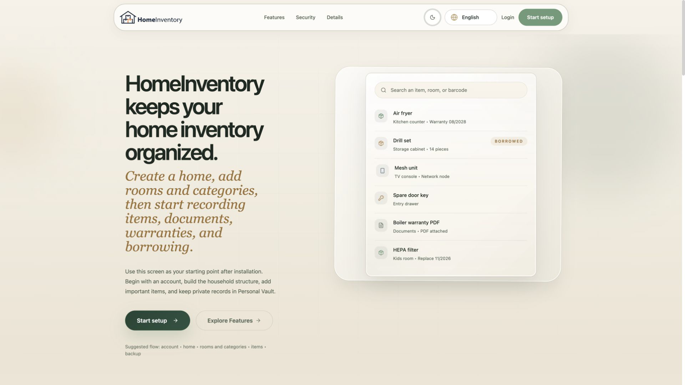
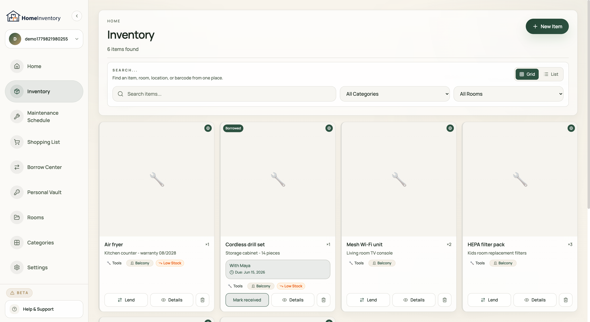
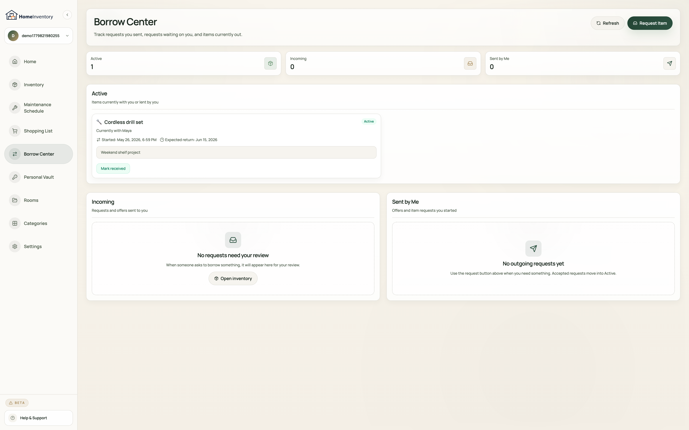
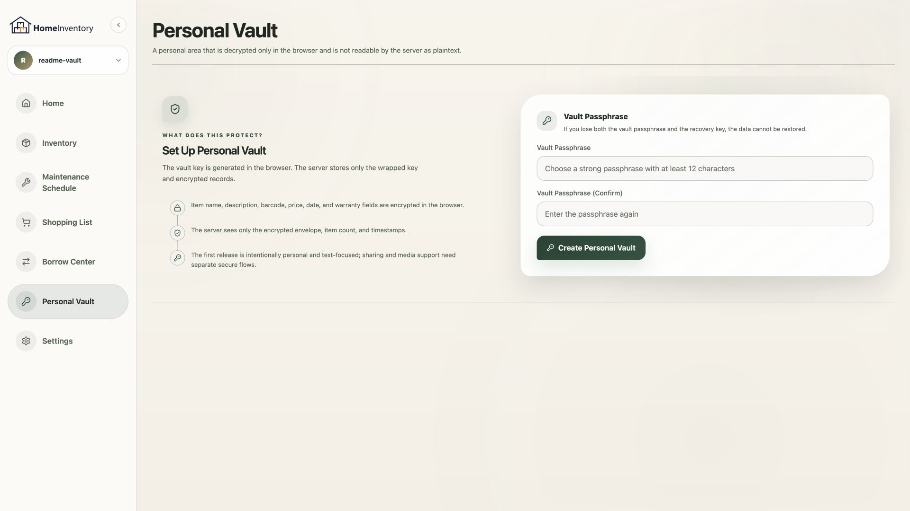
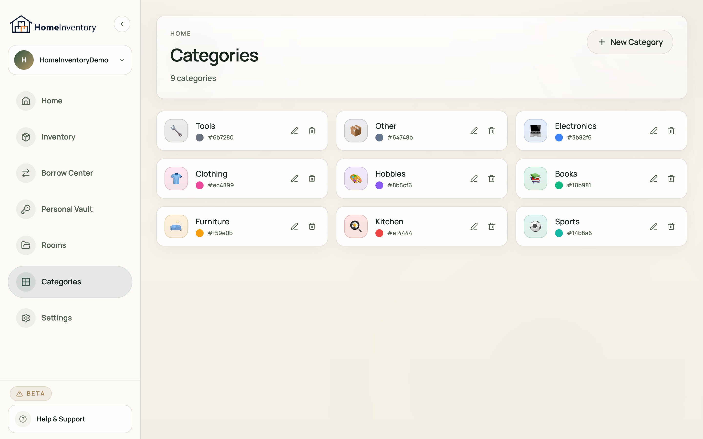

<p align="center">
  <picture>
    <source media="(prefers-color-scheme: dark)" srcset="client/public/brand/logo-full-dark.svg" />
    
  </picture>
</p>

<h1 align="center">HomeInventory</h1>

<!-- Release status: v2.2.0 release line. -->

<p align="center">
  <strong>Private, self-hostable household inventory for shared homes.</strong><br/>
  Track items, warranties, documents, borrowing, and sensitive personal records from one calm React app.
</p>

<p align="center">
  <a href="README.md">English</a> ·
  <a href="README.tr.md">Türkçe</a> ·
  <a href="README.de.md">Deutsch</a> ·
  <a href="README.es.md">Español</a> ·
  <a href="README.ar.md">العربية</a>
</p>

<p align="center">
  
  
  
  
  
  
  
</p>

<p align="center">
  <a href="#preview">Preview</a> ·
  <a href="#why-homeinventory">Why</a> ·
  <a href="#features">Features</a> ·
  <a href="#security--privacy">Security</a> ·
  <a href="#quick-start">Quick Start</a> ·
  <a href="#documentation">Docs</a> ·
  <a href="CHANGELOG.md">Changelog</a> ·
  <a href="ROADMAP.md">Roadmap</a>
</p>

---

## Preview

<p align="center">
  
</p>

<details>
<summary><strong>More screenshots: Inventory, Borrow Center, Vault, Categories</strong></summary>

<br/>

<p align="center">
  
</p>
<p align="center">
  
</p>
<p align="center">
  
</p>
<p align="center">
  
</p>

</details>

HomeInventory is built for families, roommates, and small households that need a practical inventory without turning private records into a shared spreadsheet.

> [!NOTE]
> **v2.2.0 is a security maintenance release.** It patches the open critical npm `shell-quote` advisory, keeps the mobile camera/photo work from v2.1.3, and documents the remaining upstream Tauri/GLib status for the optional Linux launcher.

## Why HomeInventory

- **One household, many people:** create or join homes, switch the active home, and keep shared inventory scoped to the right members.
- **Real item records:** track photos, rooms, locations, categories, quantities, warranty dates, invoice data, notes, and attachments.
- **TypeScript-powered client:** the React interface now runs on a TypeScript/Vite codebase, improving editor feedback, refactor confidence, and build-time checks.
- **Sensitive data has a better place:** Personal Vault keeps highly private records away from regular household search and collaboration.
- **Fast lookup in daily life:** use search, barcode scanning, QR labels, and mobile-friendly screens when you are standing in front of the shelf.
- **Built to self-host:** Express, SQLite, Docker support, environment documentation, and production secret-loading flows are included.

## Features

| Area | What it covers |
| --- | --- |
| Inventory | Items, photos, rooms, categories, locations, quantities, warranty and invoice metadata |
| Shared homes | Create homes, join with house access flows, switch active homes, and keep data scoped by membership |
| Borrow Center | Incoming, outgoing, and active lending records with clear request states |
| Personal Vault | Client-side encrypted vault flow for IDs, property documents, access codes, and sensitive notes |
| Shopping List | Manual and inventory-linked shopping items, completed history, and low-stock suggestions |
| Smart Maintenance | Recurring item-care tasks, overdue indicators, and automated next-due-date calculations |
| Labels and scanning | Barcode scanning, item QR labels, and mobile-friendly lookup |
| Backup and restore | Owner-only export/import flows with guarded confirmations |
| Auth and recovery | JWT auth, Google OAuth, email verification, TOTP 2FA, trusted devices, and recovery keys |
| Desktop Launcher | Optional Tauri GUI for local setup, dependency checks, profile start/stop, backups, logs, and QR/LAN access |
| Internationalization | 100+ selectable UI locale packs with fallback behavior and automated validation checks |

## Security & Privacy

- **AES-256-GCM encryption at rest** protects sensitive inventory, auth, and profile fields before they are written to disk or SQLite.
- **Encrypted media handling** strips image metadata and stores protected media blobs instead of raw uploads.
- **Household-scoped authorization** keeps rooms, categories, items, media, and backups limited to the active household membership.
- **Personal Vault separation** keeps highly sensitive records out of normal shared inventory flows.
- **Rate limiting and hardened auth routes** reduce brute-force and abuse risk around login, backup, and interactive endpoints.

> [!IMPORTANT]
> HomeInventory uses strong server-side encryption, but the main inventory encryption key is still managed by the server. An operator with database access and runtime secrets can decrypt protected inventory data. Use Personal Vault for records that need stronger separation from shared household workflows.

## Architecture

```text
React SPA (Vite, PWA, Tailwind)
        |
        v
Express API (JWT, OAuth, rate limiting)
        |
        v
SQLite storage + encrypted media
```

## Tech Stack

| Backend | Frontend |
| --- | --- |
| Node.js, Express, better-sqlite3 | React 18, Vite, Tailwind CSS |
| JWT, bcrypt, Passport Google OAuth 2.0 | React Router v6, react-i18next |
| Helmet, express-rate-limit, i18next | Lucide React, html5-qrcode |
| Sharp, encrypted media storage | PWA-ready responsive UI |

## Quick Start

Choose the setup method that best fits your workflow:

### Option A: Desktop GUI Launcher

For local/self-hosted use, the Desktop GUI Launcher can verify dependencies, configure a local environment, isolate database/uploads per profile, and run both frontend and backend services from one window.

1. **Download:** Go to the [GitHub Releases](https://github.com/asdteke/HomeInventory/releases) page and download the launcher package for your OS (`.dmg` for macOS, `.exe`/`.msi` for Windows, `.AppImage`/`.deb`/`.rpm` for Linux).
2. **Install & Open:** Install and launch the application.
3. **Start:** Click **Launch HomeInventory**. The launcher checks ports, starts the API and UI, then shows the local URL and a QR code for devices on the same network.

For isolation details and advanced settings, see [GUI_LAUNCHER.md](GUI_LAUNCHER.md).

---

### Option B: Terminal Setup

#### Prerequisites
- Node.js 18+
- npm 9+
- Git

#### 1. Install dependencies
```bash
git clone https://github.com/asdteke/HomeInventory.git
cd HomeInventory
npm run install-all
```

#### 2. Create a local environment file
```bash
cp .env.example .env
```
Set at least these values inside `.env`:
```env
NODE_ENV=development
PORT=3001
SITE_URL=http://localhost:5173
JWT_SECRET=replace-with-a-long-random-secret
APP_ENCRYPTION_KEY=replace-with-32-byte-base64-or-64-char-hex-key
APP_ENCRYPTION_KEY_ID=2026-03-local
```
> [!TIP]
> Generate secure secrets using `openssl rand -hex 32` for `JWT_SECRET` and `openssl rand -base64 32` for `APP_ENCRYPTION_KEY`.

#### 3. Run the app
```bash
npm run dev
```
- Frontend: `http://localhost:5173`
- Backend API: `http://localhost:3001`

#### 4. Build for production
```bash
npm run build
npm start
```

---

### Option C: Docker Setup

Deploy HomeInventory quickly using pre-configured containers:

```bash
docker compose up -d
```
For advanced configuration, reverse proxy setup, and production deployment, see [DOCKER.md](DOCKER.md).

## Documentation

- [DOCKER.md](DOCKER.md): Docker, reverse proxy, and self-hosting notes
- [GUI_LAUNCHER.md](GUI_LAUNCHER.md): Desktop GUI Launcher setup, isolation details, and development guide
- [README_ENVIRONMENT_SETUP.md](README_ENVIRONMENT_SETUP.md): environment variables and secret-management setup
- [CONTRIBUTING.md](CONTRIBUTING.md): contribution guidelines
- [SECURITY.md](SECURITY.md): vulnerability reporting process
- [CHANGELOG.md](CHANGELOG.md): release history and upgrade notes
- [ROADMAP.md](ROADMAP.md): short-term project direction

Recommended GitHub topics for maintainers: `home-inventory`, `self-hosted`, `inventory-management`, `household`, `pwa`, `sqlite`, `express`, `react`, `docker`, `privacy`, `qr-code`, `barcode`, `2fa`.

## Language Note

The product ships with **100+ selectable UI locale packs**. English and Turkish are the most actively reviewed product languages; other locales can fall back per key when a translation is incomplete.

## Contributing

Issues and pull requests are welcome. For larger changes, open an issue first so the implementation can stay aligned with the security model, household scoping, and localization structure.

## Legal Note

HomeInventory is an independent open-source project. It is not affiliated with, endorsed by, or connected to any commercial product or company using a similar name.

## License

MIT. See [LICENSE](LICENSE).
